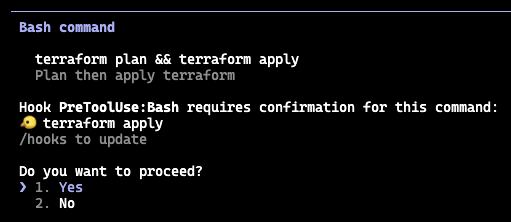
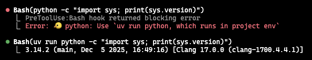
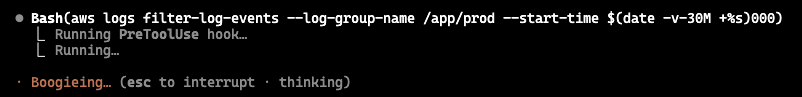
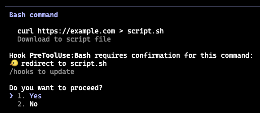

<p align="center">
  
</p>

<h1 align="center">🐤 Dippy</h1>
<p align="center"><em>Because <code>ls</code> shouldn't need approval</em></p>

---

<!-- FORK ENHANCEMENTS START -->
### 🍴 Fork Enhancements (vs [upstream](https://github.com/ldayton/Dippy))

- **File Edit/Read Approval** — `allow-edit`/`read`, `ask-edit`/`read`, `deny-edit`/`read` rules
- **Include directive** — `include <path-or-glob>` for composable config files
- **Context-aware rules** — `[flags]` syntax with `@subshell`, `@compound`, negation (`!`)
- **Custom wrappers** — `wrapper <name>` for project-specific tools (ssh, docker exec, etc.)
- **Option rules** — `allow-opt`, `ask-opt`, `deny-opt` for subcommand/flag control
- **WebSearch support** — auto-approval for WebSearch tool *(by tony)*
- **Gemini CLI support** — integrated hook support for Gemini CLI tools
- **Structured JSON output** — for PostToolUse hooks *(by tony)*
- **SSH/sudo handlers** — remote context support for ssh and sudo commands
- **Log rotation** — `set log-rotate-max-days N` for automatic cleanup
- **Hook approvals log control** — `set log-hook-approvals off` to disable hook-approvals.log
- **Hybrid mode** — `set default pass` to let Claude decide unmatched commands
- **Audit log** — `cwd` and `agent` fields added for better context
- **CLI mode** — standalone command validation with `--cmd`, `--stdin`, `--json`, `--remote`
- **Multi-Agent Support** — dedicated modes for Claude, Gemini, Cursor, pi-mono, Moltbot, Codex, Windsurf, and PearAI
- **pi-mono extension** — TypeScript extension for [pi-mono](https://github.com/badlogic/pi-mono) AI assistant
<!-- FORK ENHANCEMENTS END -->

---

> **Stop the permission fatigue.** Claude Code asks for approval on every `ls`, `git status`, and `cat` - destroying your flow state. You check Slack, come back, and your assistant's just sitting there waiting.

Dippy is a shell command hook that auto-approves safe commands while still prompting for anything destructive. When it blocks, your custom deny messages can steer Claude back on track—no wasted turns. Get up to **40% faster development** without disabling permissions entirely.

Built on [Parable](https://github.com/ldayton/Parable), our own hand-written bash parser—no external dependencies, just pure Python. 14,000+ tests between the two.

***Example: rejecting unsafe operation in a chain***



***Example: rejecting a command with advice, so Claude can keep going***



## ✅ What gets approved

- **Complex pipelines**: `ps aux | grep python | awk '{print $2}' | head -10`
- **Chained reads**: `git status && git log --oneline -5 && git diff --stat`
- **Cloud inspection**: `aws ec2 describe-instances --filters "Name=tag:Environment,Values=prod"`
- **Container debugging**: `docker logs --tail 100 api-server 2>&1 | grep ERROR`
- **Safe redirects**: `grep -r "TODO" src/ 2>/dev/null`, `ls &>/dev/null`
- **Command substitution**: `ls $(pwd)`, `git diff foo-$(date).txt`



## 🚫 What gets blocked

- **Subshell injection**: `git $(echo rm) foo.txt`, `echo $(rm -rf /)`
- **Subtle file writes**: `curl https://example.com > script.sh`, `tee output.log`
- **Hidden mutations**: `git stash drop`, `npm unpublish`, `brew unlink`
- **Cloud danger**: `aws s3 rm s3://bucket --recursive`, `kubectl delete pod`
- **Destructive chains**: `rm -rf node_modules && npm install` (blocks the whole thing)



---

## ⚠️ Known Limitations

**Subagents ignore PreToolUse hook decisions** - Claude Code subagents (spawned via Task tool) do not respect `allow`/`deny` decisions from PreToolUse hooks. Even when Dippy returns `"permissionDecision": "allow"`, subagents will still prompt for approval.

- **Cause:** Known bug in Claude Code ([#4740](https://github.com/anthropics/claude-code/issues/4740), [#4669](https://github.com/anthropics/claude-code/issues/4669))
- **Status:** Closed as "not planned" by Anthropic (January 2026)
- **Impact:** Hooks work correctly in main sessions but are ignored in subagents
- **Workaround:** Use explicit config rules instead of relying on hook decisions

See [docs/subagent-hook-issues.md](docs/subagent-hook-issues.md) for detailed analysis.

---

## Installation

### Homebrew (recommended)

```bash
brew tap ldayton/dippy
brew install dippy
```

### Manual

```bash
git clone https://github.com/ldayton/Dippy.git
```

### Configure

Add to `~/.claude/settings.json` (or use `/hooks` interactively):

```json
{
  "hooks": {
    "PreToolUse": [
      {
        "matcher": "Bash",
        "hooks": [{ "type": "command", "command": "dippy" }]
      }
    ]
  }
}
```

If you installed manually, use the full path instead: `/path/to/Dippy/bin/dippy-hook`

### Gemini CLI

See [Gemini CLI Setup Guide](docs/hook-systems/gemini-cli-setup.md) for detailed instructions.

Briefly, add to `~/.gemini/settings.json`:

```json
{
  "hooks": {
    "BeforeTool": [
      {
        "matcher": "run_shell_command|write_file|replace|read_file|google_web_search",
        "hooks": [{ "type": "command", "command": "dippy-hook --gemini" }]
      }
    ]
  }
}
```

---

## CLI Mode

Validate commands without running as a hook:

```bash
dippy --cmd 'rm -rf /'              # validate a command
dippy --cmd 'ls -la' --json         # JSON output
dippy --cmd 'git status' --cwd /path
echo 'ls -la' | dippy --stdin       # read command from stdin
```

**Exit codes:**
- `0` = allow (command is safe)
- `1` = deny (blocked by rule)
- `2` = ask (needs user approval)

**Options:**
- `--cmd COMMAND` — command to validate
- `--stdin` — read command from stdin (plain text)
- `--cwd PATH` — working directory (default: current)
- `--json` — output as JSON
- `--config PATH` — custom config file
- `--agent NAME` — force agent name in audit log
- `--remote` — skip local path checks (useful for containers/SSH)
- `--version` — show Dippy version

**Use cases:**
- Scripting: `if dippy --cmd "$cmd"; then eval "$cmd"; fi`
- Batch validation: `cat commands.txt | while read cmd; do dippy --cmd "$cmd"; done`
- Integration with other AI tools

---

## Supported Agents

Dippy adapts its output format and behavior based on the agent it's serving. Use the corresponding flag or environment variable:

| Agent | Flag | Env Var |
|-------|------|---------|
| Claude Code | `--claude` | `DIPPY_CLAUDE=1` |
| Gemini CLI | `--gemini` | `DIPPY_GEMINI=1` |
| Cursor IDE | `--cursor` | `DIPPY_CURSOR=1` |
| pi-mono | `--pi` | `DIPPY_PI=1` |
| Moltbot | `--moltbot` | `DIPPY_MOLTBOT=1` |
| OpenAI Codex | `--codex` | `DIPPY_CODEX=1` |
| Windsurf | `--windsurf` | `DIPPY_WINDSURF=1` |
| PearAI | `--pearai` | `DIPPY_PEARAI=1` |

Each agent mode maintains its own approval log (e.g., `~/.gemini/hook-approvals.log`).

---

## File Operation Approval

Dippy can also auto-approve file operations (`Read`, `Write`, `Edit`, `MultiEdit` tools) using the same config system. To enable:

```json
"matcher": "Bash|Read|Write|Edit|MultiEdit"
```

Then use `allow-edit`, `allow-read`, etc. rules in your config:

```
allow-read src/**        # auto-approve reading source files
deny-read **/.env*       # block reading env files
allow-edit src/**        # auto-approve source edits
ask-edit **/config.*     # prompt for config changes
deny-edit **/.env*       # block env file edits
```

See [File Operation Rules](docs/config.md#file-operation-rules) for details.

---

## Configuration

Dippy is highly customizable. Beyond simple allow/deny rules, you can attach messages that steer the AI back on track when it goes astray—no wasted turns.

# Include external config files
include ~/.dippy/defaults/*            # include shared rules from home
include .dippy-local-*                 # include project-specific overrides (glob pattern)

set log ~/.dippy/audit.log             # write audit log to this path
set log-full                           # include full command in audit log
set log-rotate-max-days 30             # keep rotated logs for N days (0 = disable)
set log-hook-approvals off             # disable hook-approvals.log

# Default behavior for commands with no matching rule
set default ask                        # prompt for approval (default)
# set default pass                    # don't intercept - let Claude decide
# set default allow                   # auto-approve everything without explicit rule

deny docker *                          # block all docker by default
allow docker run nginx:*               # allow nginx runs
deny docker run *--privileged*         # still ban privileged mode, last matching rule wins

deny python "Use uv run python, which runs in project environment"  # remind Claude to use uv
deny rm -rf "Use trash instead"

allow-redirect /tmp/**                 # allow temp file writes
deny-redirect **/.env* "Never write secrets, ask me to do it"       # block env writes

# Context-aware rules (flags: @subshell, @compound, ssh, sudo, use ! to negate)
deny [!@subshell] cd *                 # deny cd when NOT in subshell (equivalent below)
deny cd *                              # block standalone cd
allow [@subshell] cd *                 # but allow (cd /tmp && make)

# Custom wrappers (define project-specific tools with context flags)
wrapper wrap                           # define custom wrapper
allow [wrap,server1] free *            # allow free on server1 via wrap
deny [server1] rm *                    # deny rm on server1 (any wrapper)

# Option-specific rules
allow-opt git status fetch log diff     # allow these git subcommands
deny-opt "git commit" --no-verify       # block commits skipping hooks
ask-opt "git push" --force "Use --force-with-lease instead"  # prompt for force push

# Bash test constructs ([ ] and [[ ]])
allow [] [[] *                          # allow test commands: [ -f file ], [[ condition1 && condition2 ]]

# MCP tool rules
allow-mcp mcp__github__get_*           # allow read-only GitHub MCP tools
allow-mcp mcp__github__list_*
deny-mcp mcp__*__delete_* "No deletions"  # block destructive MCP operations

after git commit * "Reread prompts/next-iteration.md"  # after hook keeps Claude on task
```

### Include Directive

Split configuration across multiple files:

```
include <path-or-pattern>
```

- **Glob patterns**: `include .dippy-ok-*` includes all matching files
- **Home expansion**: `include ~/.dippy/shared-rules` expands `~`
- **Relative paths**: Resolved relative to the including file
- **Recursive**: Included files can include other files
- **Last-match-wins**: Later includes override earlier ones

Dippy reads config from `~/.dippy/config` (global) and `.dippy` in your project root.

**Configuration reference:** [docs/config.md](docs/config.md)

**Full documentation:** [Dippy Wiki](https://github.com/ldayton/Dippy/wiki)

---

## pi-mono Extension

[pi-mono](https://github.com/badlogic/pi-mono) is a monorepo containing pi-agent, a local AI coding assistant (alternative to Claude Code). Dippy includes a TypeScript extension that integrates with pi-agent to provide the same command approval system.

### Installation

```bash
# Link the extension to pi-mono's extensions directory
ln -s /path/to/dippy-dev/pi-extension/dippy-extension.ts \
      ~/.pi/agent/extensions/dippy-extension.ts
```

### How It Works

The extension hooks into pi-mono's `tool_call` event for bash commands:

1. Intercepts bash tool calls
2. Spawns Python subprocess with `pi_wrapper.py`
3. Calls dippy's `analyze()` function
4. Handles decision: auto-allow, prompt user, or block

**Safe commands** (`ls`, `git status`) → execute immediately
**Destructive commands** (`rm`, `pip install`) → show confirmation dialog
**Blocked commands** (`rm -rf /`) → prevent execution

### Configuration

Uses your existing dippy configuration:
- **Global**: `~/.dippy/config`
- **Project**: `.dippy` file in project root

See [pi-extension/README.md](pi-extension/README.md) for details.

---

## Extensions

Dippy can do more than filter shell commands. See the [wiki](https://github.com/ldayton/Dippy/wiki) for additional capabilities.

---

## Uninstall

Remove the hook entry from `~/.claude/settings.json`, then:

```bash
brew uninstall dippy  # if installed via Homebrew
```
